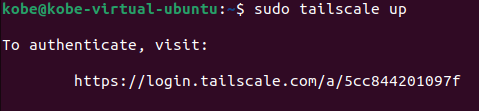

# 💙🤍Documentation🤍💙

## 📘Table of Contents

1. [📘Table of Contents](#📘table-of-contents)
2. [🖖Introduction](#🖖introduction)
3. [💩Group members](#💩group-members)
4. [🎨Network Design](#🎨network-design)
    1. [🎨Globel Design](#🎨globel-design)
    2. [🎨WAN Design](#🎨wan-design)
    3. [🎨DMZ Design](#🎨dmz-design)
    4. [🎨LAN Design](#🎨lan-design)
5. [🔎Addressing/names](#🔎addressingnames)
6. [🚬VPN Services](#🚬vpn-services)
    1. [🚬VPN Settings For A Client](#🚬vpn-settings-for-a-client)
    2. [🚬Server Settings](#🚬server-settings)
    3. [🚬VPN Test](#🚬vpn-test)
7. [🛡️Firewall Rules](#🛡️firewall-rules)
8. [🪖DMZ Services](#🪖dmz-services)
9. [🧮🧮Testing](#🧮🧮testing)
10. [📁Attachments](#📁attachments)
    1. [📁Router Configurations](#📁router-configurations)
    2. [📁Firewall Configurations](#📁firewall-configurations)
    3. [📁Server Configurations & Scripts](#📁server-configurations--scripts)
    4. [📁Timesheets](#📁timesheets)
11. [🔗References](#🔗references)

---

## 🖖Introduction

This is the documentation for the project of the course `Network 2 - ISB` at the `KDG`. The goal of this project is to create a network with a DMZ, LAN, WAN, VPN, and a firewall. The network should be able to handle high availability, load balancing, and stress tests...

## 💩Group members

- Student 1: Elias De Hondt 0160712-80
- Student 2: Kobe Wijnants 0163403-55

## 🎨Network Design

### 🎨Globel Design


### 🎨WAN Design


### 🎨DMZ Design


### 🎨LAN Design


## 🔎Addressing/names

### 🔎Globel

| Name            | IP Address | Interface |
|-----------------|------------|-----------|
| Router 1        | 10.10.1.1  | Gig0/0    |
| Router 2        | 10.10.2.1  | Gig0/0    |
| Router 1        | 10.10.4.1  | Gig1/0    |
| Router 2        | 10.10.4.2  | Gig1/0    |

### 🔎LAN
| Name            | IP Address | Interface |
|-----------------|------------|-----------|
| Server 3 (DNS)  | 10.10.3.10 | Fa0       |
| Server 4 (DHCP) | 10.10.3.11 | Fa0       |
| Router 3        | 10.10.3.1  | Gig2/0    |
| Router 3        | 10.10.1.2  | Gig0/0    |
| Router 3        | 10.10.2.2  | Gig1/0    |
| Switch 3        | 10.10.3.2  | Lo0       |

### 🔎DMZ
| Name            | IP Address | Interface |
|-----------------|------------|-----------|
| Server 1 (Web)  | 10.10.4.10 | Gig0      |
| Server 1 (Web)  | 10.10.4.11 | Gig1      |
| Server 2 (Web)  | 10.10.4.12 | Gig0      |
| Server 2 (Web)  | 10.10.4.13 | Gig1      |

## 🚬VPN Services

As a VPN solution we will use tailscale, this is a zero-config VPN based on wireguard.

Tailscale utilizes WireGuard's encryption and authentication mechanisms to establish secure peer-to-peer connections between devices. It assigns each device a unique tailnet IP and has dashboard for easy maintainability.

### 🚬VPN Settings For A Client

#### Linux

- Open the terminal and run:

```bash
sudo curl -fsSL https://tailscale.com/install.sh | sh
```

- Enter the root password and run the following command

```bash
sudo tailscale up
```
- Copy and Paste the link in your browser and login



- Click Connect and you should be connected to the tailnet

#### Windows

- Download the following msi installer

https://tailscale.com/download

- Run the installer

- Click Next and Install

- Then login and you should be connected to the tailnet

### 🚬VPN Settings For A Server
- Open the terminal and run:

```bash
sudo curl -fsSL https://tailscale.com/install.sh | sh
```

- Enter the root password

- Request an auth key at: https://login.tailscale.com/admin/settings/keys

- Use the auth key in the following command and add `--ssh` so you can use tailscale ssh
```bash
sudo tailscale up --authkey=[Authkey] --ssh
```

- The server should now be connected to the tailnet

### 🚬VPN Settings For A Router

Wij zullen pfsense gebruiken als router software, hierop heb je een package manager met de package "tailscaled"


### 🚬VPN Test
> Een VPN-client moet minimum via de VPN server aan bv een DMZ server.
> Schrijf de testprocedure hiervoor uit. Welke aanpassingen moest je maken aan de routetabel of aan de encryptie?

## 🛡️Firewall Rules
> Firewall voor je LAN
> Schrijf alle regels die gelden tussen de LAN en de DMZ/Internet in woorden uit.
> Firewall voor Internet (denk ook aan VPN)
> Schrijf alle regels die gelden tussen Internet en de DMZ/LAN in woorden uit.

## 🪖DMZ Services
> Geef hier een opsomming van de diensten en leg de werking uit van de high availability oplossing.

## 🧮🧮Testing
> Omschrijf de procedure en toon het resultaat van high availability/load balancing/stress testen van je server diensten.

## 📁Attachments

### 📁Router Configurations

### 📁Firewall Configurations
> (deze mogen ook Linux iptables regels zijn, of een vyos configuratie of  Cisco router configuraties)

### 📁Server Configurations & Scripts
> Geef hier enkel de nodige software en speciale opties/bestanden, bij voorkeur in een script 

### 📁Timesheets
> Wie heeft wat wanneer gedaan. Bereken ook ongeveer het totaal aantal uren dat jullie aan de opdracht besteedt hebben. bv:

## 🔗References